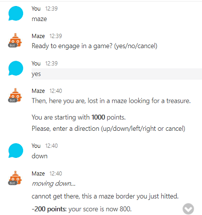

# Maze Cisco Spart Chat Bot

A game-type chat bot implementing:
- botkit threaded conversations
- user preferences (choose a level)
- leveraging a simple [node-maze](https://github.com/ObjectIsAdvantag/node-maze) library
- plus a recast NLP example to detect directions

Built from this [botkit-template](https://github.com/CiscoDevNet/botkit-template) for Cisco Spark.

## Quick start on Glitch

Click 

Then open the `.env` file and paste your bot's token into the SPARK_TOKEN variable.

You bot is all set, responding in 1-1 and 'group' spaces, and sending a welcome message when added to a space,
Its healthcheck is accessible at your application public url, suffixed with "/ping" 

_Note that thanks to Glitch 'PROJECT_DOMAIN' env variable, you did not need to add a PUBLIC_URL variable pointing to your app domain._

## Example

